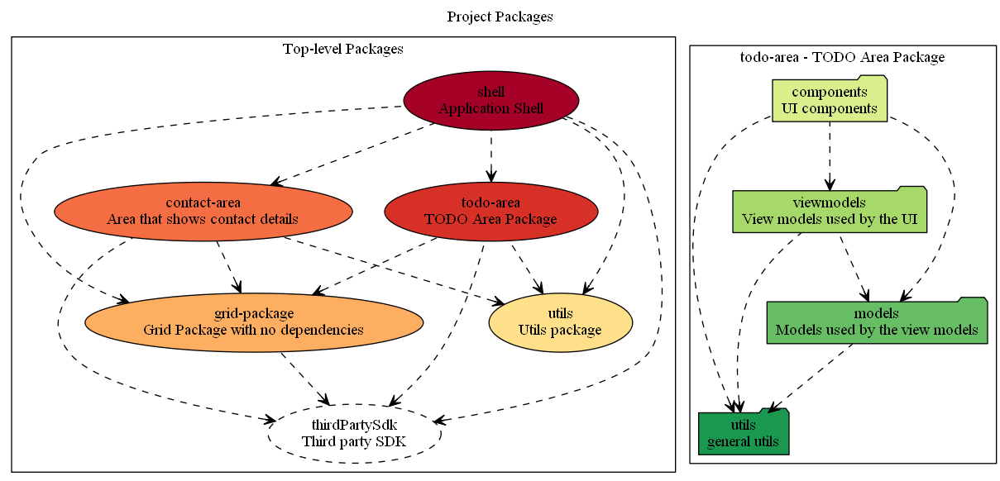

# generating diagrams of the architecture described in tslint.json

The configuration of `tslint-folders` is a description of the architecture of your TypeScript project (see [tslint.tslint-folders.json](tslint.tslint-folders.json)` for an example).

`tslint-folders` can generate dot files from its configuration. A dot file is a simple format to describe a graph of nodes.

If you install `graphviz`, then you can generate image diagrams from those dot files.

So, you can automatically generate architecture diagrams from the same configuration that `tslint-folders` uses to validate the source code.

---

## install graphviz

https://graphviz.gitlab.io

---

## generating a graph image from tslint-folders

`./generate_graph_image <path to tslint.json>`

### example

`./generate_graph_image_example`

## assumptions

- the machine has an environment variable `TEMP` pointing to a temporary files location.

---

## notes for Windows

### Windows download

https://graphviz.gitlab.io/_pages/Download/Download_windows.html

Windows + Q -> Environment variables.

Add this to the PATH environment variable:

C:\Program Files (x86)\Graphviz2.38\bin

So then `dot.exe` is reachable.

### executing bash scripts on Windows

- use cmder (bash)

http://cmder.net/

---

## references

### bash cheat sheet

https://devhints.io/bash

### graphviz

https://www.graphviz.org/

### graphviz online

http://www.webgraphviz.com/

### graphviz in visual code

extension 'Graphviz Preview'
